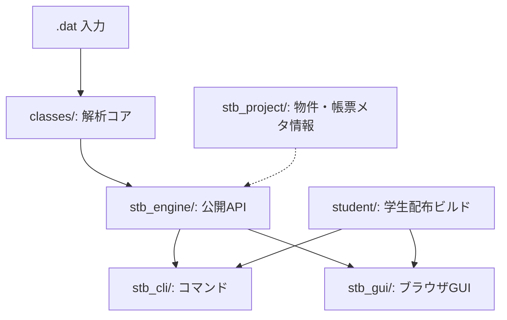
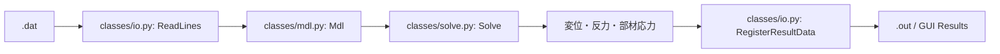
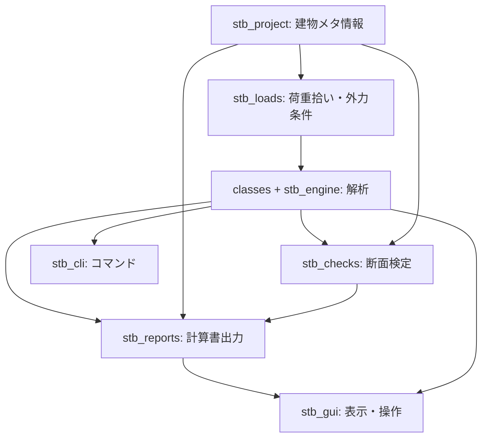

# Structural Toolbox プロジェクト見取り図

この文書は、プロジェクト全体の構成を見失わないための参照メモです。  
確認申請用・学校演習用の機能を追加するときは、まずこの見取り図に立ち返って、どの層に置くべきかを確認します。

## 全体像

Structural Toolbox は、大きく見ると次の4層構造です。

| 場所 | 役割 |
| --- | --- |
| `classes/` | 解析エンジン本体。節点、部材、材料、荷重、剛性行列、求解、結果出力を担当 |
| `stb_engine/` | `classes/` を包む薄い公開API。CLI/GUI/Python API はここを通る |
| `stb_cli/` | `stb solve`, `stb validate`, `stb gui` などのコマンド |
| `stb_gui/` | FastAPI + ブラウザGUI。モデル表示、Solve、結果表示 |
| `stb_project/` | `model.project.json` 用。建物情報、通り、層、部材分類、帳票設定などの上位メタ情報 |
| `tests/` | 回帰テスト |
| `data/`, `examples/` | サンプル `.dat` |
| `docs/` | 入力形式、セットアップ、学生/教員向け手順 |
| `student/` | ZIP/Setup.exe 作成用。学生配布パッケージのビルド専用 |

確認申請用の帳票範囲は、先に [`report_gap_map.md`](report_gap_map.md) で ASTIM計算書PDFとの差分、現状出力、木造平屋MVP対応、対象外項目を固定します。

## 解析の流れ

実際の構造解析はほぼ `classes/` にあります。  
`stb_engine/`, `stb_cli/`, `stb_gui/` は、それを使いやすくする外側の層です。

## 主要 Python ファイル

### `classes/`

| ファイル | 役割 |
| --- | --- |
| `io.py` | `.dat` を読む `ReadLines()`、結果テキストを作る `RegisterResultData()` |
| `mdl.py` | モデル全体 `Mdl`。節点、部材、荷重、拘束、ダイアフラム等を保持 |
| `solve.py` | 剛性行列・荷重ベクトルを組み、連立方程式を解く |
| `nd.py` | 節点 |
| `elm.py` | 梁・柱などの1D部材 |
| `mat.py` | 材料 |
| `sec.py` | 断面 |
| `cons.py` | 支点・拘束条件 |
| `ld.py` | 点荷重、部材荷重、面荷重、自重、荷重組合せ |
| `ejnt.py` | 部材端部バネ・リリース |
| `diaphragm.py` | ダイアフラム、膜要素、MPC接続 |
| `axis.py`, `plt.py` | 描画・プロット用メタ情報 |
| `common.py` | 幾何・ベクトル・共通定数 |

### `stb_engine/`

| ファイル | 役割 |
| --- | --- |
| `run.py` | `parse_input`, `solve_model`, `format_results`, `run_from_file` |
| `errors.py` | パースエラー・解析エラー用の例外 |
| `__init__.py` | 外部公開APIのまとめ |

`stb_engine/` は「外部から安全に呼ぶ入口」です。今後もなるべく薄く保ちます。

### `stb_cli/`

| ファイル | 役割 |
| --- | --- |
| `main.py` | `stb solve`, `stb validate`, `stb gui`, `stb version` |
| `__main__.py` | `python -m stb_cli` 用 |

CLI は主に開発・自動化・テスト向けです。

### `stb_gui/`

| ファイル | 役割 |
| --- | --- |
| `server.py` | FastAPIサーバー、ブラウザ起動、API定義 |
| `model_json.py` | `Mdl` をブラウザ表示用 JSON に変換 |
| `static/index.html` | GUIのHTML |
| `static/viewer.js` | Three.jsによる3D表示・操作 |
| `static/style.css` | 見た目 |
| `__main__.py` | `python -m stb_gui` 用 |

GUI は「解析結果を見せる層」で、解析自体は `stb_engine` 経由です。

### `stb_project/`

| ファイル | 役割 |
| --- | --- |
| `schema.py` | `model.project.json` のスキーマ、物件情報、通り、層、部材分類、帳票設定 |
| `__init__.py` | 公開API |

これは確認申請用・教育用の上位情報を持つための層です。  
現時点では解析コアに深く統合されているというより、`.dat` に意味付けを足すための別レイヤーです。

## 開発時の考え方

| やりたいこと | 触る場所 |
| --- | --- |
| 解析式・剛性・荷重処理を直す | `classes/` |
| `.dat` の入力形式を増やす | `classes/io.py`, `docs/input_format.md`, `tests/` |
| CLIコマンドを増やす | `stb_cli/main.py` |
| GUI表示を直す | `stb_gui/model_json.py`, `stb_gui/static/viewer.js` |
| 計算書PDFとの差分やMVP範囲を確認する | `docs/report_gap_map.md` |
| 確認申請用の物件情報・通り・層を扱う | `stb_project/` |
| 計算書出力を作る | 今後 `stb_reports/` を追加するのがよさそう |
| 木造断面検定を作る | 今後 `stb_checks/` を追加するのがよさそう |
| 学生配布を直す | `student/`, `.bat`, `docs/学生用_*` |

## 今後のおすすめ整理

今の構造を保つなら、次の分け方が自然です。

## 保守上の注意

- `classes/` は解析コアなので、むやみに実務帳票や教育UIのロジックを入れない。
- `classes/` の import は歴史的にフラット import 前提なので、通常パッケージ化すると影響が大きい。
- 確認申請用の「通り・層・偏心率・帳票・検定」は、解析コアではなく外側の `stb_project`, `stb_checks`, `stb_reports` に置く。
- 学校演習用の機能も、解析コアを直接分岐させず、教育向けの薄いレイヤーとして作る。
- 学生配布は `student/` と `.bat` が担当するが、アプリ本体のロジックは `stb_cli/` と `stb_gui/` に置く。

## まとめ

このリポジトリは、**レガシーFEMコア（`classes/`）を `stb_engine` で包み、CLI とブラウザGUIから同じ解析を呼ぶ**構成です。  
入力・出力は一貫して `.dat` / `.out` が中心です。

今後、確認申請用・教育用の機能を追加するときは、`classes/` を肥大化させず、外側のレイヤーに整理していく方針が安全です。
